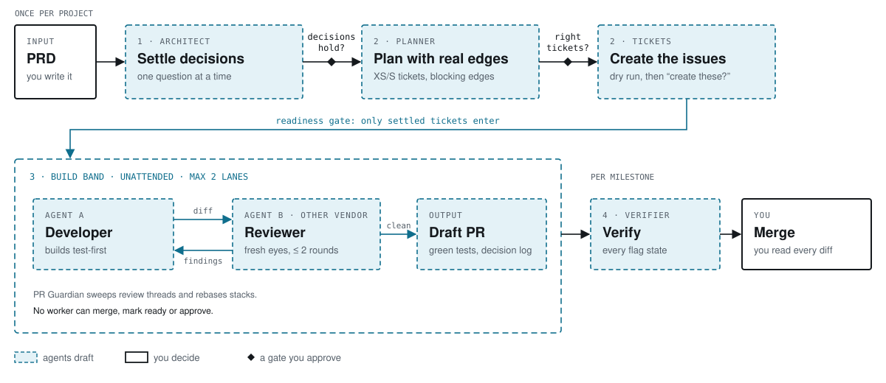

<h1 align="center">AI Light Factory</h1>

<p align="center">
  <b>A light software factory.</b><br>
  PRD in, reviewed draft PRs out. The agents draft. You merge.
</p>

<p align="center">
  <a href="https://github.com/lmagsino/ai-light-factory/actions/workflows/validate.yml"></a>
  <a href="LICENSE"></a>
</p>

<p align="center">
  <picture>
    <source media="(prefers-color-scheme: dark)" srcset="docs/assets/line-dark.svg">
    
  </picture>
</p>

## What is a light factory?

A *dark* factory ships code that no human has read. A *light* factory keeps you in the loop and moves your judgement to where it pays off. You settle the decisions and approve the plan up front. Agents build and review unattended. You read every diff before it merges.

AI Light Factory never marks a PR ready, never approves, and never merges. The tools enforce that, not the prompt.

## Why I built this

I'm a tech lead. Over the past year my work moved from "an engineer with an AI pair" to "an engineer running a line of agents". Running a line like this on a production codebase taught me three things:

- **The bottleneck moves.** Agents write code faster than anyone can read it, so the guardrails belong on decisions, review and verification.
- **Unlimited parallelism is a trap.** Run wide open, it burns a week of model budget in days, and nobody can review that much. Two lanes is the ceiling.
- **A reviewer from the same vendor shares the builder's blind spots.** Its misses are silent.

This is that line, rebuilt from scratch for open source, with each lesson turned into a default. — **Leo Magsino Jr**

## How it works

| Stage | What happens | You decide |
|---|---|---|
| **1&nbsp;·&nbsp;Architect** | Reads the PRD and everything it links, then settles every open decision with you, one question at a time | *Do the decisions hold?* |
| **2&nbsp;·&nbsp;Planner** | Splits the work into small tickets with real dependency edges, then creates the issues | *Right tickets? Create them?* |
| **3&nbsp;·&nbsp;Build&nbsp;band** | Up to two tickets at a time. One agent builds test-first, an agent from another vendor reviews, and a draft PR opens only when the tests pass | Nothing. It runs unattended |
| **4&nbsp;·&nbsp;Verifier** | Runs the app and checks every feature-flag state, reporting PASS, FAIL or NOT RUN | *Merge.* That step is always yours |

## Guardrails

- **Decisions before code.** A ticket without criteria, edges and a size never reaches an agent.
- **Stops at a draft PR.** Merge, ready and approve are blocked for every worker, whatever agent it runs.
- **Green tests or no PR.**
- **A second vendor reviews,** with fresh context, for at most two rounds.
- **Every call is in the PR body:** what was fixed, what was left for you, and what was dropped and why.
- **Bounded:** two lanes, a ticket budget, and per-seat caps.
- **NOT RUN is reported, never hidden.** Silence doesn't count as a pass.

How each one is enforced: [docs/guardrails.md](docs/guardrails.md).

## The rules

1. **Never guess for the human.** Wait for a decision instead of inventing one.
2. **Questions belong on the ticket,** not in a run.
3. **No evidence, no block.** The search that returns nothing is the evidence.
4. **Stack on open work.** An unmerged dependency is a base branch, not a blocker.
5. **Two review rounds, then a human.**

And one habit: **check the effect, not the message.** More in [docs/rules.md](docs/rules.md).

## Bring your own agents

Every seat (Developer, Reviewer, Guardian, Verifier) is an agent you choose. Any coding-agent CLI that takes a prompt can fill one. I run Claude Code for building and Codex for review, but those are just what I use. See [docs/install.md](docs/install.md#choosing-agents-per-seat).

## Quick start

```text
/plugin marketplace add lmagsino/ai-light-factory
/plugin install alf@ai-light-factory
```

```text
/alf:setup                          # once per repo
/alf:architect docs/prd.md          # settle the decisions
/alf:plan                           # tickets with real edges
/alf:tickets                        # asks "create these?"
/alf:loop "M1" --budget 2           # unattended, two lanes max
/alf:verify "M1"                    # every flag state
```

Requirements: git, an authenticated `gh`, `jq` and `python3`. The orchestrator runs as a Claude Code plugin today. Full setup: [docs/install.md](docs/install.md).

<!-- Results from real runs go here, failures included. See docs/demo.md. -->

## Docs

[The line](docs/the-line.md) · [Guardrails](docs/guardrails.md) · [Rules](docs/rules.md) · [Install and agents](docs/install.md) · [Cost](docs/cost.md) · [Comparison](docs/comparison.md) · [Demo](docs/demo.md)

## About

Built by **Leo Magsino Jr**, a tech lead working on how teams ship with fleets of coding agents without losing the plot.
[GitHub](https://github.com/lmagsino)

The term *light software factory* comes from Addy Osmani, and the Architect's interview style from Matt Pocock's `grill-with-docs`. See [CREDITS.md](CREDITS.md). Licensed [MIT](LICENSE).
