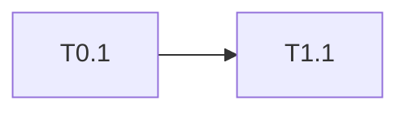

# Plan: {feature}

- **Date:** {YYYY-MM-DD}
- **Decisions:** `.factory/decisions/{file}.md`
- **Integration branch:** {main}

## Precedent verdict

Cost follows precedent, not scope. Answer this before anything is sized.

- **What is the same:** the precedent this work matches, with named files and a count. ("A new one is a handler plus a query file, against eleven existing examples.")
- **What is new, itemised:** each capability with no precedent, plus the evidence it is absent (the search that returned nothing, the table that is not in the schema).
- **Why that costs more:** each new capability tied to the milestones it adds, in the plan's own units, so a reader can subtract.
- **Verdict:** routine | new shape

> If the verdict is *new shape*, paste this paragraph wherever the estimate is given: {name the shape, list what is new, state the delta}.
> Send it with the estimate, not afterwards. A number without its reason gets defended instead of understood.

## Milestones

| M | Name | Starts after | Completes after | Tickets | Days |
|---|---|---|---|---|---|

"Starts after" and "completes after" are separate columns. Merging them makes independent milestones look serial.

## Tickets

Sizes: **XS = 0.125 d**, **S = 0.5 d**. Anything bigger is split before it is written.

### T{m}.{n} · {title} · {XS|S}
- **Acceptance criteria:**
  - [ ] …
- **Decisions:** D3, D7 (or none)
- **Blocked by:** T{m}.{n} (or none)
- **Test plan:**

## Graph

## Lane model

| Lanes | Wall-clock (days) | Note |
|---|---|---|
| 1 | {sum of all tickets} | one ticket after another |
| 2 | {…} | the band's ceiling |
| unlimited | {critical path} | the dependency floor |

## Shared-file hotspots

Files several milestones would all edit (one query file, one handler, one registry). Each one serialises the plan. Name them, and add an early ticket that splits each into regions so milestones can build side by side.

| File | Milestones that touch it | Split by ticket |
|---|---|---|

## External gates

Things outside the repo that block a ticket: credentials, a partner sandbox, a data export. Each one is an edge in the graph.

## Risks

| Risk | Likelihood | What we do |
|---|---|---|
